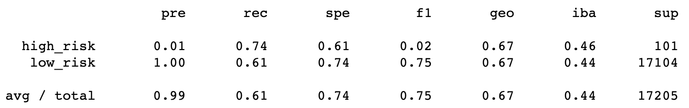
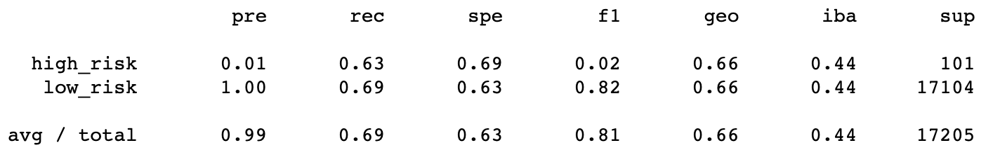
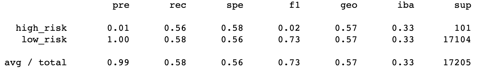
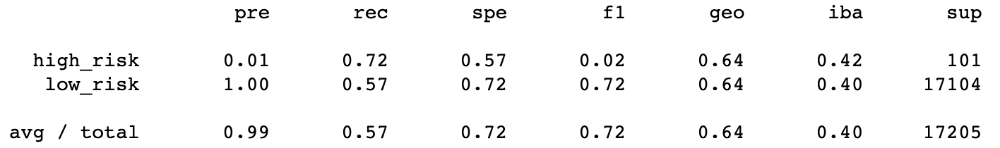
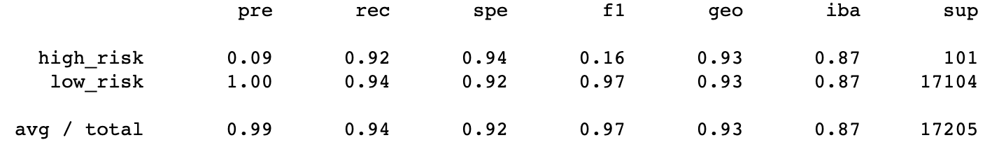

# Credit_Risk_Analysis

## Overview
The purpose of this analysis was to predict credit risk using resampling models, the SMOTEEN algorithm, and ensemble classifiers.

## Results
### Random Oversampling
Balanced accuracy score: 0.67

### SMOTE Oversampling
Balanced accuracy score: 0.66

### Undersampling
Balanced accuracy score: 0.57

### Combination (Over and Under) Sampling
Balanced accuracy score: 0.64

### Balanced Random Forest Classifier
Balanced accuracy score: 0.78

### Easy Ensemble AdaBoost Classifier
Balanced accuracy score: 0.93

## Summary
In summary, the Easy Ensemble AdaBoost Classifier model had the highest balanced accuracy score by the far. At first glance, this tells us that it is the most accurate model for predicting credit risk. 
